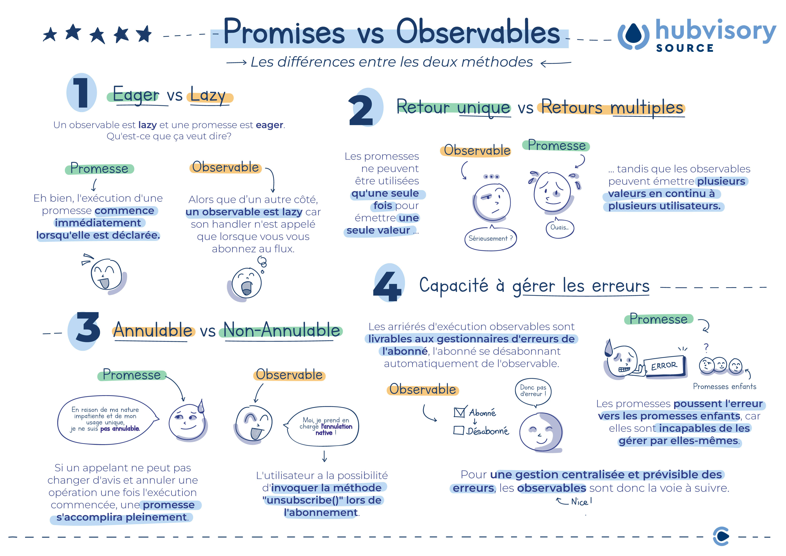
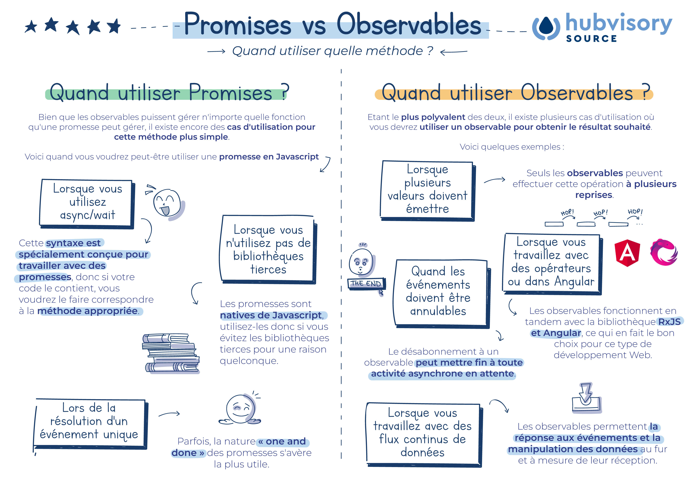

# Quelles différences entre Promises et Observables ?

Hubvisory Source t'explique en 5 minutes les différences majeures entre ces deux méthodes, pour une meilleure compréhension

Plongeons dans les différences clés entre ces deux méthodes et comment elles fonctionnent dans un programme.

## Les différences principales entre Promises et Observables

## Quand utiliser Promises ? Quand utiliser Observables ?

